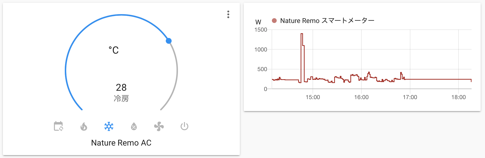
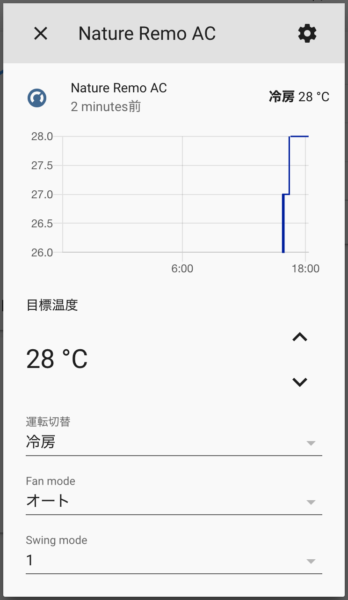

# 🌿🎮 Home Assistant integration for Nature Remo 🎮🌿

---

> ### 📢 FORK INFORMATION
> 
> This version is a fork from @yutoyazaki's integration, as at the current time it is not being maintained.  
> This fork introduces the Home Assistant GUI configuration method, and also adds a configurable sensor refresh period.
> 
> **Note**: this was done for my own interest, and use of the Nature Remo Mini devices. Unfortunatley I cannont support this integration for any other Nature Remo devices.

---

Yet another [Home Assistant](https://www.home-assistant.io) component for [Nature Remo](https://en.nature.global/en/).

⚠️ This integration is neither Nature Remo official nor Home Assistant official. **Use at your own risk.** ⚠️



## ✨ Supported features ✨

- [x] Air Conditionar
  - [x] Set mode (e.g. cool, warm, blow etc.)
  - [x] Set temperature
  - [x] Set fan mode
  - [x] Set swing mode
  - [x] Show current temperature
  - [x] Remember previous target temperatures when switching modes back and forth
- [x] Energy Sensor (Nature Remo E/E Lite)
  - [x] Fetch current power usage
- [ ] Switch
- [ ] Light
- [ ] TV
- [ ] Others
  - [ ] Fetch sensor data

Tested on Home Assistant Core 2025.5.1

## 🚀 Installation 🚀

### HACS (Recommended)

1. Install [HACS](https://hacs.xyz/)
2. Add this repository as a custom repository in HACS - or simply click the button below.  

&nbsp;&nbsp;&nbsp;&nbsp;[](https://my.home-assistant.io/redirect/hacs_repository/?owner=doenau&repository=https%3A%2F%2Fgithub.com%2Fdoenau%2Fnature-remo&category=Integration)

3. Install "Nature Remo" from the HACS store
4. Restart Home Assistant

### Manual Install

1. Download this repository
2. Create `custom_components/nature_remo` folder at your config directory
3. Copy files into it

```
{path_to_your_config}
├── configuration.yaml
└── custom_components
    └── nature_remo
        ├── __init__.py
        ├── config_flow.py
        ├── climate.py
        ├── manifest.json
        ├── sensor.py
        ├── const.py
        └── translations
            └── en.json
```

## ⚙️ Configuration ⚙️

### UI Configuration (Recommended)

1. Go to https://home.nature.global and sign in/up
2. Generate access token
3. In Home Assistant, go to Configuration → Integrations
4. Click the "+ Add Integration" button
5. Search for "Nature Remo"
6. Enter your access token
7. Click Submit

### YAML Configuration (Legacy)

⚠️ **Note**: YAML configuration is deprecated. Please use the UI configuration method instead.

If you have existing YAML configuration, it will be automatically imported. You will see a persistent notification suggesting to remove the following YAML configuration from you configuration.yaml. 

```yaml
# Example of legacy YAML configuration (not recommended)
nature_remo:
  access_token: YOUR_ACCESS_TOKEN
```

## 🔧 Troubleshooting 🔧

If you encounter any issues:

1. Check that your access token is correct
2. Ensure your Nature Remo device is online
3. Check the Home Assistant logs for any error messages
4. Try restarting Home Assistant

## 🤝 Contributing 🤝

Contributions are welcome! Please feel free to submit a Pull Request.

## 📄 License 📄

This project is licensed under the MIT License - see the [LICENSE](LICENSE) file for details.